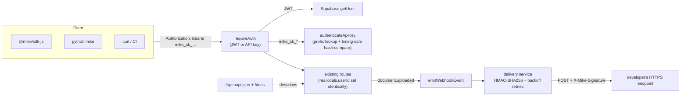

# feat: developer platform — programmatic API keys, OpenAPI spec & webhooks

## Summary

This PR adds the missing **platform layer** that turns Mike from "an app with an
API" into "a platform you can build on":

1. **Programmatic API keys** — long-lived, revocable, scoped `mike_sk_…`
   credentials. The auth middleware now accepts **either** a Supabase JWT
   (unchanged) **or** an API key.
2. **OpenAPI 3.1 contract** — served at `GET /openapi.json` and rendered as
   interactive docs at `GET /docs`.
3. **Webhooks** — register endpoints, receive HMAC-signed events with
   exponential-backoff retries and full delivery history.
4. **Developer portal UI** — a Settings → Developer page to manage keys,
   webhooks, and inspect deliveries.
5. **SDKs wired to keys** — `@mike/api-client`, `@mike/sdk-js`, and the Python
   `mike` package all treat an API key as a first-class auth option.

Everything is **additive**: existing JWT auth, MFA, and every current route are
unchanged.

## Motivation

Mike already ships TS + Python SDKs, but both authenticate only with a
short-lived **Supabase session JWT** — the browser's credential. That blocks the
things developers actually want: calling the API from **scripts / CI**, getting
**push events** instead of polling, and discovering the API from a
**machine-readable contract**.

This is the **"Inspired by Dub → API & Developer Platform"** direction. The fork
ecosystem corroborates it: forks keep adding BYOK/provider integrations, MCP
connectors, and developer-onboarding tours. The natural layer *underneath* all
of that is a first-class **programmatic credential + event delivery + published
contract** — exactly what this PR builds.

## Architecture overview



Key pieces:

- `apps/api/src/core/apiKeys.ts` — pure crypto: generate / hash / **timing-safe
  verify** (no DB, fully unit-tested).
- `apps/api/src/core/webhookSignature.ts` — HMAC sign / verify / secret-gen.
- `apps/api/src/lib/apiKeys.ts`, `lib/webhooks.ts` — DB + delivery layers.
- `apps/api/src/middleware/auth.ts` — the additive API-key branch + scope check
  + `requireUserSession` guard.
- `apps/api/src/lib/openapi.ts` — the hand-authored OpenAPI 3.1 document.
- `apps/api/src/routes/apiKeys.ts`, `routes/webhooks.ts` — management routes.

## Design decisions

The full rationale — alternatives, trade-offs, and security model — is in
[**ADR 0001: Developer Platform**](docs/adr/0001-developer-platform.md).
Highlights:

- **Opaque hashed key, not a JWT or a stored secret.** Instantly revocable,
  useless if the DB leaks. SHA-256 (not bcrypt) is correct for a high-entropy
  random secret.
- **Hand-authored OpenAPI**, because the repo runs **Zod v4** and
  `zod-to-openapi` targets v3 — a curated typed doc is cleaner than shimming
  every schema. Generating SDKs *from* the spec is the planned next step.
- **In-process webhook delivery**, not Redis/BullMQ — Mike is self-hostable as a
  single service. Every delivery row is persisted up front; a durable queue is
  future work.

## Security notes

- **Hash, don't store** — only `sha256(token)` + a non-secret prefix are
  persisted; the secret is shown once.
- **Constant-time verification** (`crypto.timingSafeEqual`) for both API keys and
  webhook signatures, to defend against timing-based forgery.
- **Prefix lookup** avoids a table scan *and* a timing-unsafe SQL equality on the
  hash.
- **Scopes** — `read` for GET/HEAD, `write` otherwise.
- **No privilege escalation** — key/webhook management requires a user session;
  a key cannot mint a key.
- **API keys bypass interactive MFA by design** (a key is a possession factor the
  user minted and can revoke) — rationale in the ADR.
- **Webhook HMAC** (`X-Mike-Signature`) proves authenticity + integrity; HTTPS
  required in production.
- **RLS** enabled + deny-all on all three new tables, privileges revoked from
  `anon`/`authenticated`, matching the repo's default-deny posture.

## Testing

Ran in the worktree:

- `npm run typecheck --workspaces` — **pass** (api + all packages; web `tsc
  --noEmit` clean).
- `npm run build` for `@mike/core`, `@mike/api-client`, `@mike/sdk-js`,
  `apps/api` — **pass**.
- `apps/api` Vitest — **180 passed, 1 skipped** (pre-existing skip), including new
  suites:
  - `apiKeys.test.ts` — key format, hashing, timing-safe verify, and the DB
    layer accepting a valid key / rejecting a revoked / mismatched / non-key
    bearer.
  - `webhookSignature.test.ts` — deterministic HMAC, integrity + authenticity
    changes, constant-time verify, length-mismatch safety.
- Python SDK — **20 passed** (`pytest`), including API-key bearer-header
  construction and the new api-keys / webhooks resources.
- `eslint` on all new/changed API files — clean (replaced a flagged regex with
  safe URL parsing).

## How to try it

1. **Run a migration** (or apply `apps/api/schema.sql` to a fresh DB):
   `supabase/migrations/20260629000001_developer_platform.sql`.
2. **Create a key:** web app → **Settings → Developer** → name it → **Create** →
   copy the `mike_sk_…` secret (shown once).
3. **Call the API:**
   ```bash
   curl http://localhost:3001/projects \
     -H "Authorization: Bearer mike_sk_..."
   ```
   …or `new MikeClient({ baseUrl, apiKey: "mike_sk_..." })`.
4. **Explore the contract:** open `http://localhost:3001/docs` (or
   `GET /openapi.json`).
5. **Register a webhook:** Settings → Developer → add an HTTPS URL + events →
   copy the `whsec_…` secret. Upload a document and watch a `document.uploaded`
   delivery appear under **Recent deliveries**. Verify `X-Mike-Signature` with
   the snippet in [docs/developer-platform.md](docs/developer-platform.md).

## Future work

- Durable, queued delivery via **BullMQ** (dead-letter + manual replay).
- **OAuth 2.1** for third-party apps acting on behalf of users.
- **Usage analytics** per key (rate, error rate, top endpoints).
- **SDK auto-generation from the OpenAPI spec** (TS + Python).
- Per-route scope granularity beyond `read`/`write`.

## Guided tour / further reading

- [ADR 0001 — Developer Platform](docs/adr/0001-developer-platform.md)
- [Developer Platform guide](docs/developer-platform.md)
- [API docs](docs/api.md) · [SDK docs](docs/sdk.md)

---

🤖 Generated with [Claude Code](https://claude.com/claude-code)
