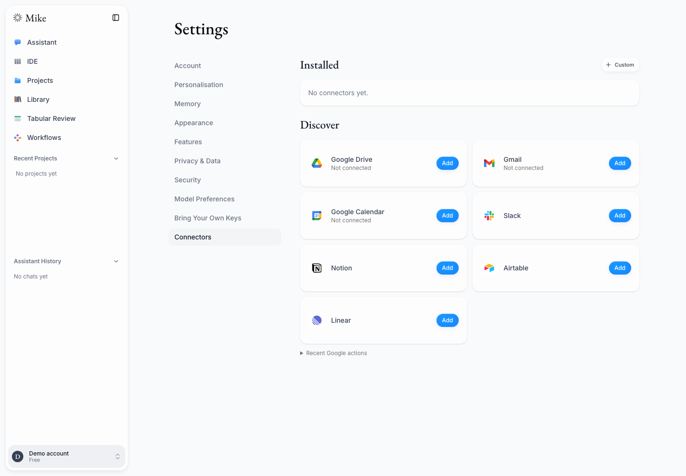
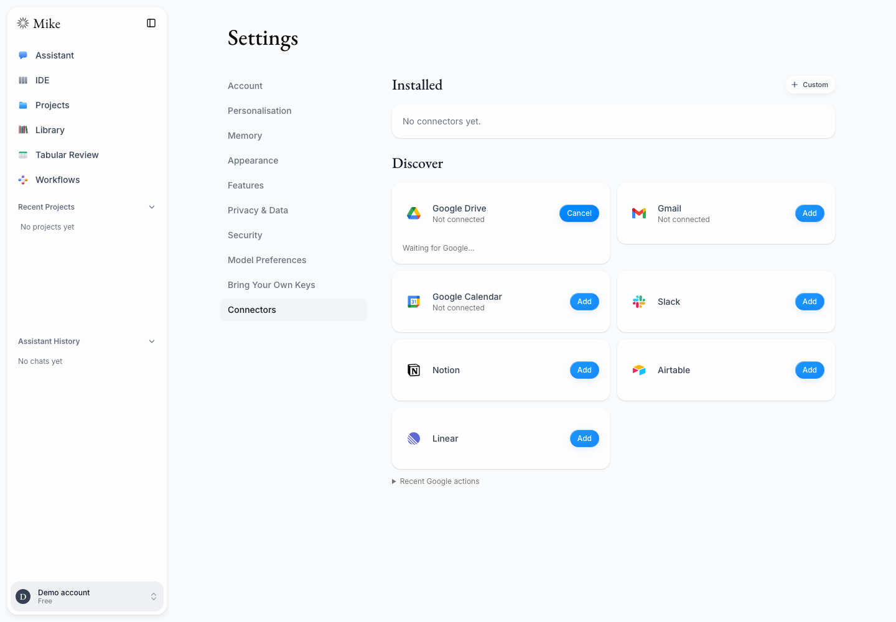
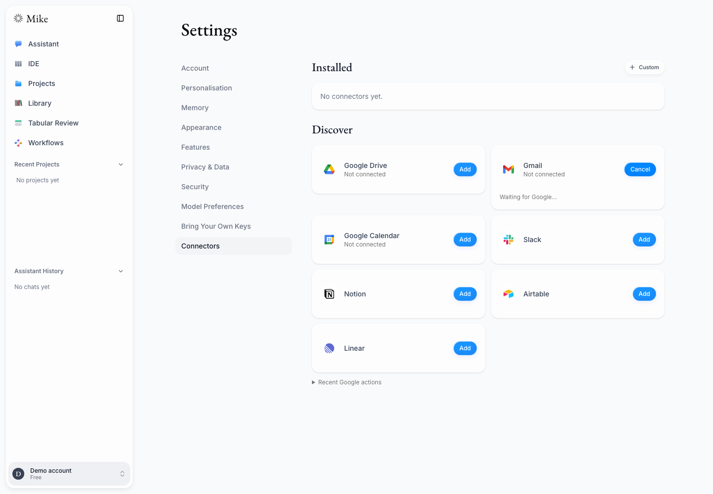
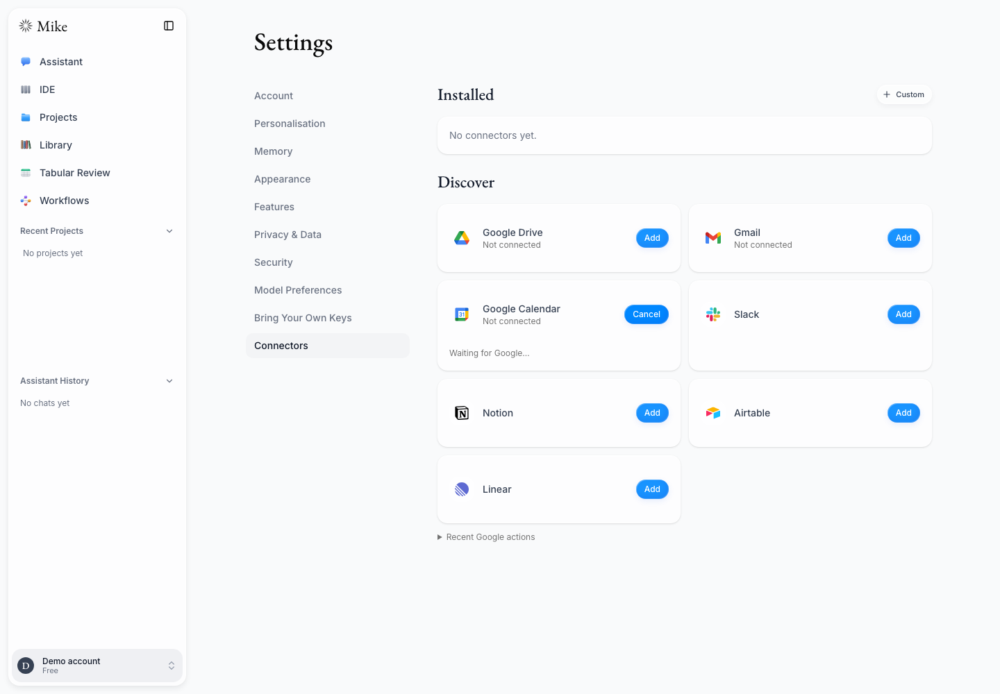
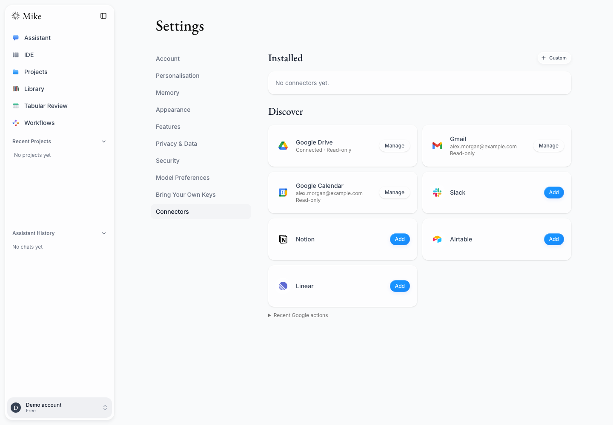
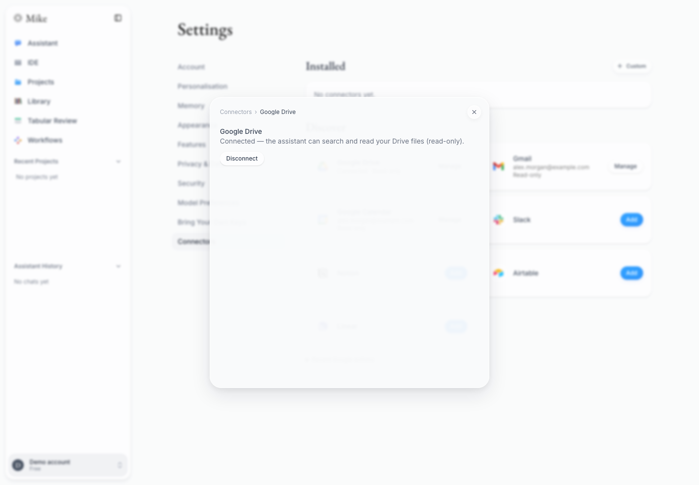
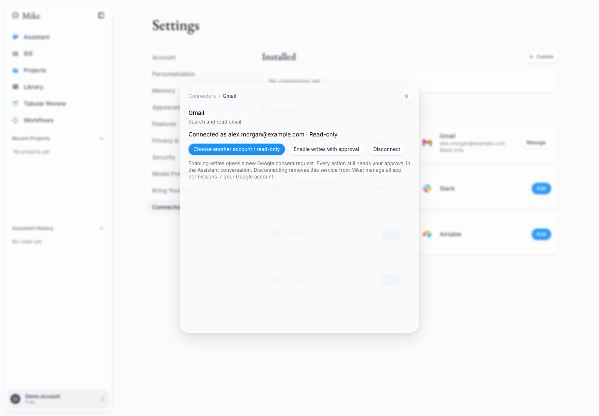
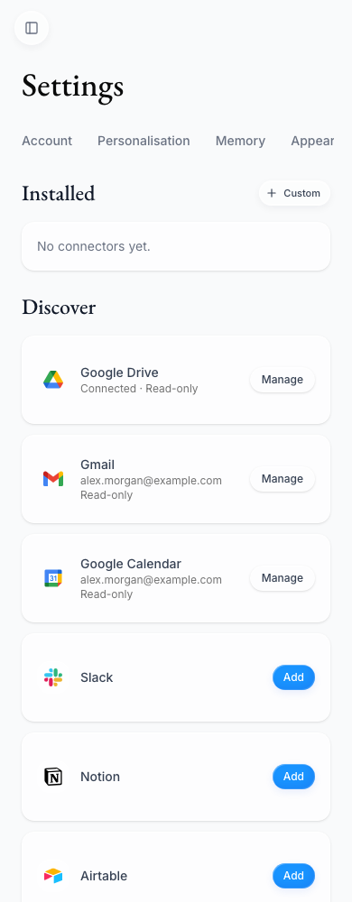
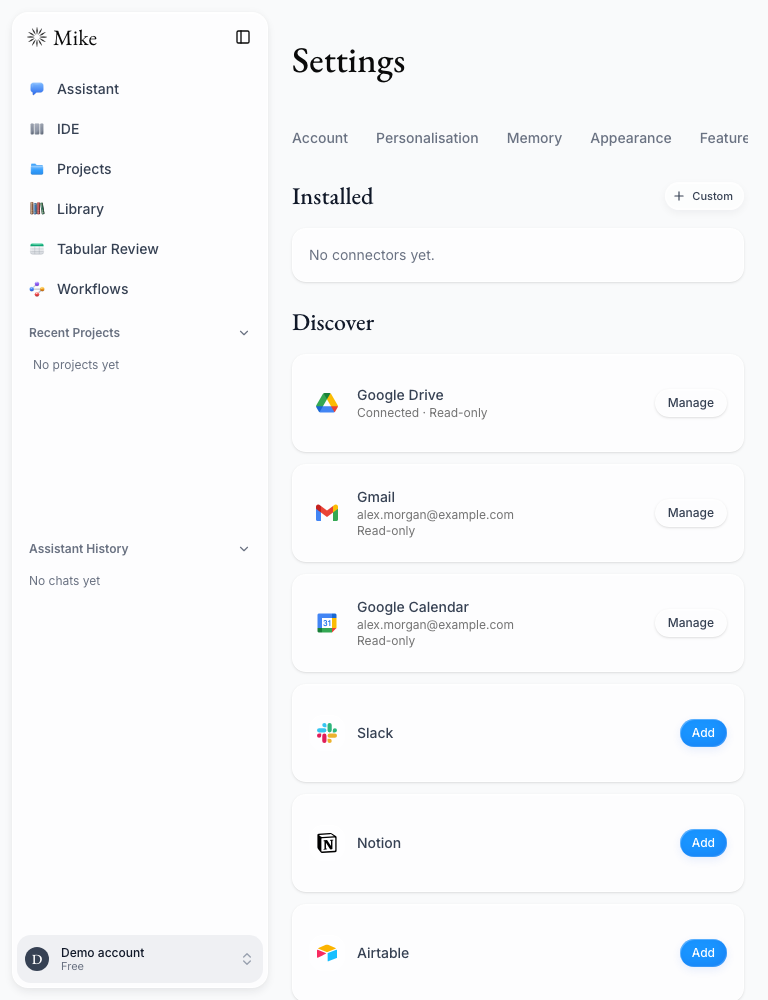
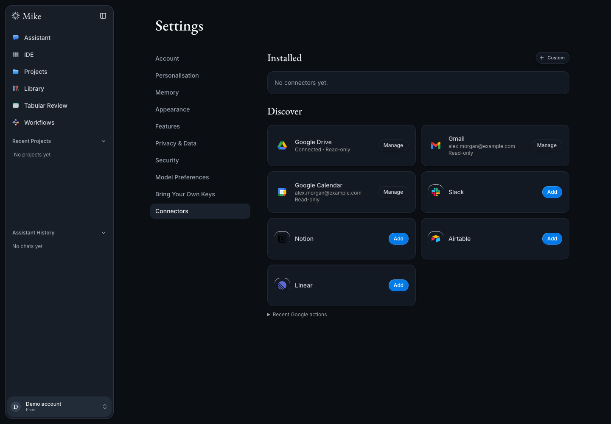

# Google connectors in Discover

Drive, Gmail, and Calendar now appear alongside the other services in Discover.
The separate Google accounts section has been removed. For a configured service,
**Add opens Google OAuth directly**, with read access by default. Users choose
the account on Google's screen; Mike has no preliminary account-selection dialog.
The OAuth request explicitly asks Google to show account selection and consent.
Google sign-in alone still does not connect any service.

While authorization is pending, the card shows Waiting for Google and Cancel.
Once connected, Manage provides disconnect, account replacement, and optional
Gmail/Calendar write upgrades. Missing server configuration still opens setup
help. Exact write approval remains inside the Assistant conversation.

## Verification

- Full frontend suite: **1,669 tests passed across 213 files**.
- Focused connector component suite: **34 passed**.
- Browser suite: **13 passed** — direct OAuth/cancellation for all three services,
  Gmail grant/write-upgrade/action/disconnect fixtures, and ten responsive/theme
  cases with normal and deliberately long emails.
- Normal email text fits a single line at 390/768/1280px; long text wraps without
  horizontal or vertical clipping. All three product logos load.
- Changed-file ESLint and production Webpack build/TypeScript passed.

Commands: `npm test --prefix frontend -- --maxWorkers=1`, focused Vitest files
for the connectors page and GoogleWorkspacePanel, and Playwright specs
`google-drive.spec.ts`, `google-workspace.spec.ts`, `google-layout.spec.ts`
against the production server. CI results for the pushed head are recorded in
[PR #434](https://github.com/open-legal-products/mike/pull/434).

## Evidence boundaries

These are actual browser screenshots of the rebuilt Mike application using
**synthetic API fixtures**, including `alex.morgan@example.com`. The provider
popup destination is intercepted for deterministic testing; no Google chooser
or consent screen is imitated in this gallery. OAuth-start screenshots show
Mike's pending state after Add and the absence of a preliminary Mike dialog.
No email was sent, no event changed, and no real Google grant was made by these
tests. Earlier live proofs and outstanding live acceptance remain in the
[combined testing report](google-integrations-2026-09-23.md).

## 1. Discover: optional connections

## 2. Drive: Add starts OAuth directly

## 3. Gmail: Add starts OAuth directly

## 4. Calendar: Add starts OAuth directly

## 5. Connected services in Discover

## 6. Drive management after connection

## 7. Gmail management after connection

## 8. Calendar management after connection

## 9. Mobile, 390px

## 10. Tablet, 768px

## 11. Dark desktop

