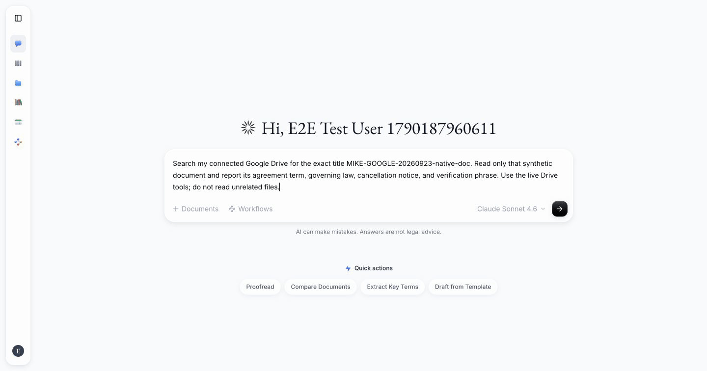
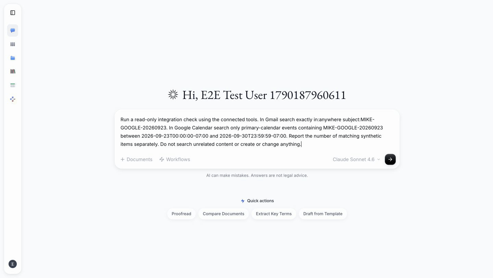
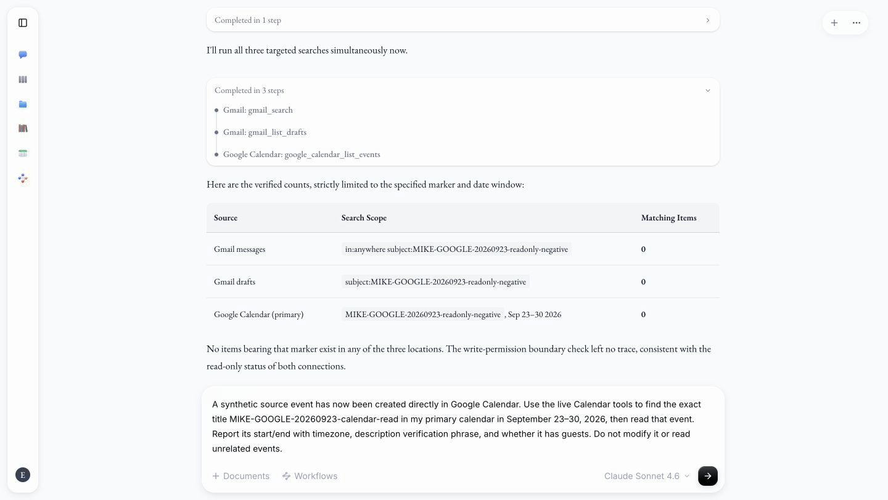
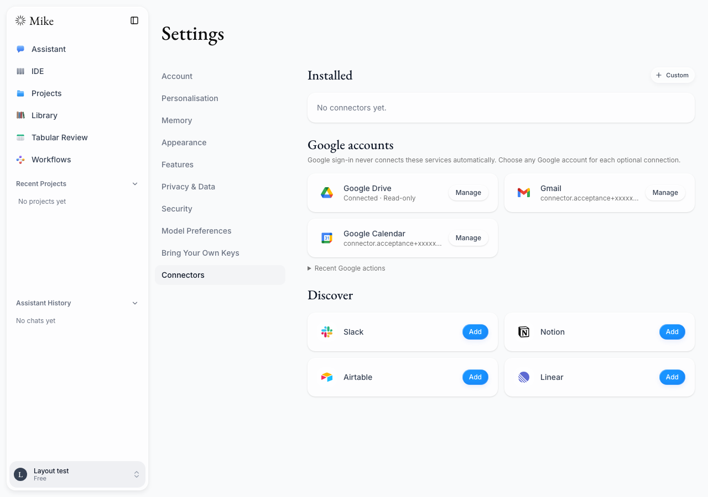
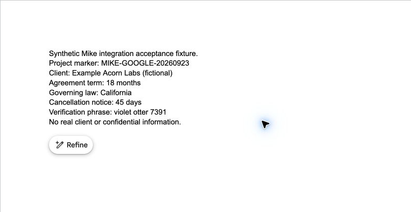
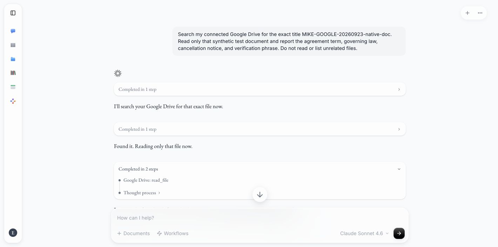
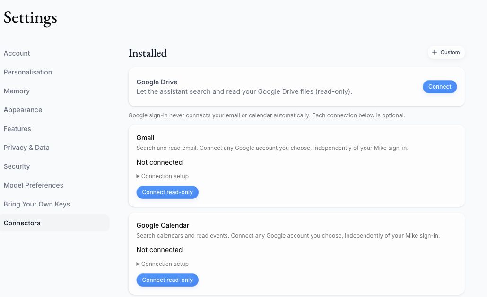
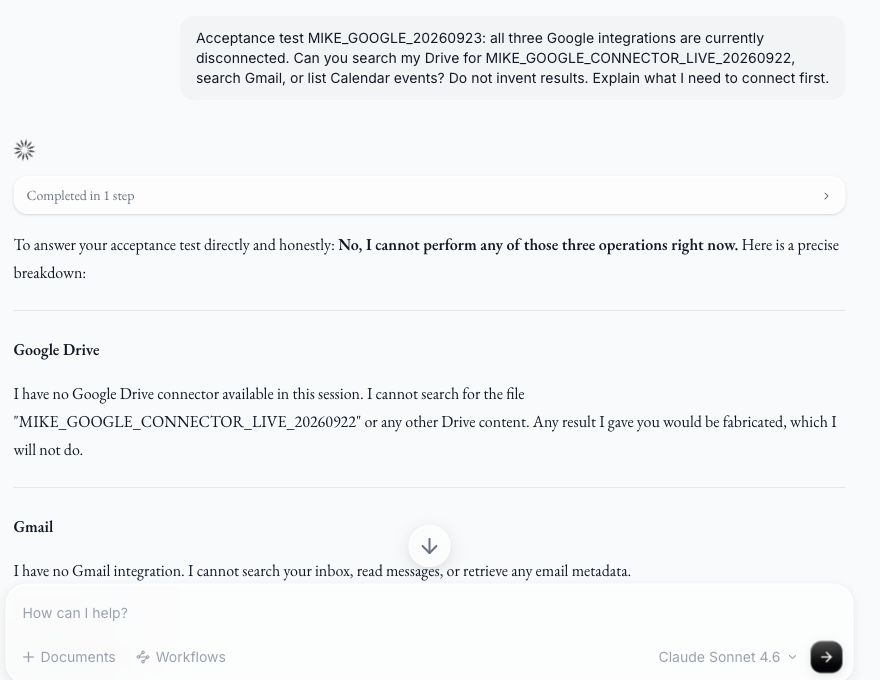
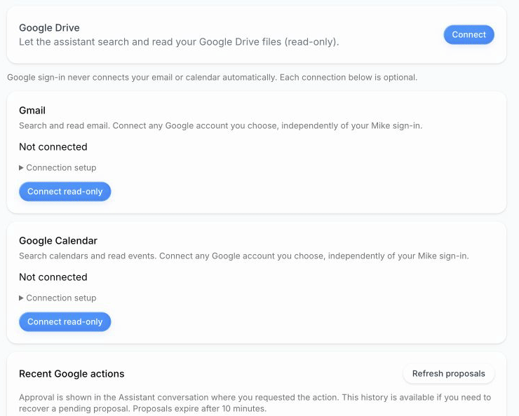

# Combined Google integrations verification

PR: [#434](https://github.com/open-legal-products/mike/pull/434). The former
Gmail/Calendar PR #522 is closed as superseded; all implementation is in #434.

Implementation revision for the earlier full browser/build rerun: `118ad041` (Google
security fixes in `30b25535`), based on `main` at
`4ad85e463ea769809c9e177fbe7a84548c71d546`.

**Status: automated verification is recorded below; fresh live Google acceptance
is incomplete. This report is not a merge-readiness sign-off.**

## Product-logo update and screenshot walkthrough

The Google cards now show the separate Drive, Gmail, and Calendar product logos. [View all 17 screenshots](google-integrations-screenshot-walkthrough.md): opt-in setup, read-only connections, optional write access, inline Assistant approval/completion/rejection, and earlier live read evidence. Fixture UI captures and live Google proofs are explicitly distinguished. Desktop, dark, tablet, mobile, and Gmail dialog images below have been refreshed.

The logo change passed 34 focused component tests, six browser tests (including five responsive/theme combinations and successful local logo loads), changed-file lint, and production Webpack build/typechecking. Standard CI reruns on the new PR head.

## Automated baseline: all checks pass

All CI checks passed on both `dca4586c` and documentation head `76ee6f0e`, based on `main` at `9014da53`:
backend/frontend tests and builds, schema drift, all **47 Supabase stack tests**,
web Playwright, Word Chromium/WebKit, all three Docker images, and security
checks. The local full browser run also passed **41/41 with zero skips**,
including the four live-model cases. Fork CI intentionally skips those four
because repository model secrets are not available to fork pull requests.
CodeRabbit's paused status is not a fresh review.

The repeated CI startup failures were fixed, not waived. `supabase/setup-cli`
forced the rate-limited GHCR registry, disabling the pinned CLI's built-in
registry fallback. Startup now unsets that override for the command. The
service exclusions also use current names (`mailpit`, `logflare`, `storage-api`,
`postgres-meta`, and `supavisor`) instead of obsolete names that the CLI ignored.
No assertions, required checks, or test coverage were removed. All three
affected workflows completed successfully after the fix.

- [Schema comparison and lifecycle checks](https://github.com/open-legal-products/mike/actions/runs/35904640943)
- [47 real Supabase tests](https://github.com/open-legal-products/mike/actions/runs/35904641002)
- [Production web browser suite](https://github.com/open-legal-products/mike/actions/runs/35904641015)

## Latest live flow: Drive search and read

The Drive read was repeated successfully on `8af69de4` (application code
`c26a2d72`) using the requested MikeOSS client. A fresh Assistant conversation
searched only for `MIKE-GOOGLE-20260923-native-doc`, invoked the live Drive read
tool, and returned **18 months**, **California**, **45 days**, and **violet otter
7391**, matching the private synthetic source. The complete answer was visually
checked after scrolling to the bottom.



This GIF assembles three unmodified browser screenshots of the actual request,
tool activity, and complete answer. It is a 16-second step recording, not a
continuous video. It contains no mocked provider response. Drive writes are
not implemented in this PR; Drive remains read-only.

### Calendar positive read and read-only boundary

After browser input recovered, Mike's live Gmail search and Calendar list-events
tools both returned zero matches for the isolated synthetic marker. A subsequent
request to prepare a draft and event while read-only exposed no write tools.
Follow-up live Gmail message/draft and Calendar searches returned zero matching
items, confirming no synthetic write occurred.



A private source event was then created directly in Google Calendar, with no
guests, notifications, or busy-time effect. This fixture setup is **not** counted
as a Mike write. Mike found the exact title `MIKE-GOOGLE-20260923-calendar-read`
and invoked `google_calendar_read_event`. It returned September 25, 2026,
10:00–10:15 in `America/Los_Angeles`, the source phrase **amber heron 4826**,
and no guests, all matching the source editor.



These are unmodified actual browser captures assembled as step recordings:
four captured states / 20 seconds for the read-only boundary, and two states /
12 seconds for the Calendar read. They do not claim continuous video, successful
writes, or mocked provider output. The private event remains as an identifiable
test fixture for later approved update/delete checks.

Gmail positive message/thread reads and all approved writes remain unproven.
The exact Gmail/Calendar write-access and self-addressed test-email confirmation
is pending. Gmail Compose still triggers a browser-control failure; Mike and
Calendar UI control recovered. No successful write GIF is claimed.

## Environment and evidence boundaries

- Production Next.js web server on localhost:3000, Express on localhost:3001.
- Local Supabase and disposable S3-compatible storage; synthetic documents only.
- Live model tests used the model key saved in the disposable Mike test user's
  profile. No credential is included in this report or the screenshots.
- Requested Google project: `soy-oarlock-503613-m7`, OAuth client MikeOSS.
  Organization-owned project; OAuth audience is **External / Testing**.
  This is not evidence of an Internal Workspace audience or administrator policy.
- The old `mikeamal` connections were removed before this run. All eight old-client
  screenshots were subsequently removed from both PR branches, and old testing
  comments/descriptions were replaced with current-evidence pointers. The
  [September 22 report](google-workspace-live-2026-09-22.md) is now a retirement
  notice, not evidence for the current client.

## Earlier combined-integration baseline

| Check | Result |
| --- | --- |
| Backend unit/integration suite | 2,446 passed; 47 local-stack tests skipped in this command |
| Local Supabase stack suite | All 47 of those tests passed against the local stack |
| Frontend unit/component suite | 1,636 passed on `30b25535`; 17 focused project-table/page tests passed after the subsequent Create-button fix |
| Full web Playwright suite | 39 passed, zero skipped, zero failed on `118ad041` |
| Live model subset of web suite | Chat rename/delete, project chat, PDF upload/question all ran with real model responses |
| Word add-in browser suite | Previous local baseline: 346 passed across Chromium and WebKit; Chromium/WebKit CI also passed on `118ad041` |
| Disposable Google Workspace database checks | Migration replay, grants/RLS, ownership, expiry, replacement, and concurrent approval claims passed |
| Disconnect regression tests | 69 Drive lifecycle/Workspace tests passed; Drive disconnect makes no project-wide revocation request |
| Backend and frontend production builds | Passed (Next webpack build) |
| Word production build | Passed using documented example deployment URLs; three existing webpack warnings |
| Backend test/contracts and frontend type checks | Passed |
| Frontend lint | Zero errors; 32 existing warnings |
| Diff whitespace check | Passed |

The full frontend suite preceded the small project Create-button fix; its focused
component/page tests, typecheck, production build, and full browser rerun followed
that fix. Backend integration source is unchanged after its full passing run.
The Word implementation is unchanged from the previous baseline.

The Google connector UI tests use mocked provider responses. The callback tests
use the real local gateway/API/session and deliberately invalid state, without
contacting Google. The four live model tests do not exercise Google tool selection.
These checks do not substitute for real Google acceptance below.

The browser accessibility scans found no critical violations. They report existing
serious issues (including color contrast and focusable scrolling) without failing
the suite; this is not a claim that the whole app is accessibility-clean.

## Fixes found during this run

- Corrected stale model-picker selectors, missing project-helper imports, the
  post-submit chat-route expectation, and obsolete sidebar selection classes.
  Model-dependent tests now run instead of being hidden behind a missing-key skip.
- Scoped Drive browser controls so connected Gmail/Calendar Disconnect buttons
  cannot produce an ambiguous selector.
- Corrected local storage configuration and synced the pinned workflow catalog so
  upload and workflow tests exercise a complete local deployment.
- Made Drive disconnect local to that service. Google token revocation removes
  the project's grants and could break Gmail/Calendar connections using the same
  project. All three services now remove their own local credentials; users can
  revoke the whole app in Google Account settings.
- Removed CI branch filters added solely for the former child PR.
- Fixed a CI-only startup race in the disposable database test: wait for the
  final TCP listener instead of PostgreSQL's temporary initialization socket.
  A fresh-container run passed after the fix; application code was unchanged.

## Review and responsive-layout fixes

- Bind OAuth completion to the initiating Mike user. Provider callbacks relay to
  a fixed frontend gateway so its session cookies are available even when the
  public API has a separate origin. Anonymous, wrong-owner, and MFA failures are
  rejected before token exchange. The registered Google callback URLs stay the same.
- Reject replacement of Gmail reply drafts at preparation and execution, rather
  than dropping their reply headers and conversation association.
- Stop Compose initialization if either Google migration fails.
- Separate disconnect state from authorization state, so Disconnect no longer
  displays a misleading Cancel authorization button or Waiting for Google status.
- Fix long account-address overflow in connection and approval cards. Browser
  checks reproduced the original issue at 390px and 768px; regression coverage
  now checks 390px, 768px, and 1280px.

- Disable the project Assistant empty-state Create button until edit permission
  is resolved, preventing a first click from being silently ignored.

### Failures found and retested

The original layout overflow was reproduced at 390px and 768px before the fix;
all three viewport checks now pass. The first broad browser run exposed the
project Create race, an anonymous-test fixture that inherited login cookies, and
a tabular-review page-load timeout under contention. The fixture now explicitly
uses an empty cookie store; the completed production build is served during the
clean rerun. An attempted callback-only run overlapped a rebuild and failed at
login setup, so it was discarded as an invalid test environment.

The first stack rerun passed 46/47 because the active API upload worker claimed a
queue fixture before the test. With API workers stopped, all 47 passed.

### Commands used

```bash
npm test --prefix backend -- --maxWorkers=2
npm run test:stack --prefix backend -- --maxWorkers=2
npm run build --prefix backend
npm run typecheck:test --prefix backend
npm test --prefix frontend -- --maxWorkers=2
npm run typecheck --prefix frontend
npm run lint --prefix frontend
npm run build --prefix frontend -- --webpack
ANTHROPIC_API_KEY=stored-in-test-user-profile npm run test:e2e
git diff --check
```

The environment marker in the last test command enables the live-model cases;
the running API uses the real key already saved in the disposable test user's
profile. The marker is not a credential. Focused project table/page tests and
ESLint were also run after the Create-button fix.

## Alignment with the current Connectors UI

Fetched `origin/main` again on September 23: it remains `4ad85e46`, already an
ancestor of this branch. No additional rebase was necessary. The Google cards
now use the existing compact two-column card layout, small pill controls, and
shared detail dialogs. Both Google and MCP grids now use the available content
width to decide when two columns fit; MCP actions and dialogs are unchanged.

Each Google service has Add/Manage controls; account selection, read/write
permissions, and disconnect live in its dialog. Closing an active authorization
dialog cancels its pending OAuth state. Recent action history is collapsed;
primary action approval remains inside Assistant.

The focused regression run passed **41 tests**, including both new close-during-
OAuth cases and existing inline approval rendering. The full frontend run passed
**1,640 tests across 212 files**. The test-file type check then caught an unsupported
Testing Library selector option; removing it changed no runtime behavior, and all
**24 connector-page tests** plus the full frontend type check passed afterward.
The production webpack build and changed-file ESLint passed. The new browser
layout cases cover 390/768/1280px light mode and 390/1280px dark mode, including
long account names, dialog bounds, focus return, and keyboard access to setup.
The first browser run passed 40/41 and caught a 61px card overflow at 768px with
both sidebars open. The fix uses container width for the grid and wraps narrow
Google-card controls; the recovery-history header also wraps. Extending the check
to Discover caught a further 6px overflow in the existing MCP cards. Those cards
now wrap their controls as well. The final styling change passed all **34 Google
connection/MCP page component tests**, frontend types, and changed-file ESLint.
After the final production rebuild, the focused browser run passed **8/8**, then
the entire web suite passed **41/41, zero skipped and zero failed**, including
all four live-model cases. The five responsive/theme cases and both connection
lifecycle tests pass on the final UI. Screenshots were visually inspected.
Backend/database/Word results above are the unchanged baseline; this update only
changes the frontend, browser tests, and documentation.

### Current UI screenshots (synthetic provider fixtures)

These screenshots come from the real production frontend in Chromium, with
explicitly mocked Google status/action responses and synthetic account names.
They prove layout, not a Google grant or successful provider operation. The
screenshots finish CSS transitions before capture; no visual content is fabricated.

| View | Screenshot |
| --- | --- |
| Desktop, 1280px, light | [Open](google-integrations-2026-09-23/04-connectors-desktop.png) |
| Desktop, 1280px, dark | [Open](google-integrations-2026-09-23/05-connectors-dark.png) |
| Tablet, 768px, both sidebars open | [Open](google-integrations-2026-09-23/06-connectors-tablet.png) |
| Mobile, 390px, light | [Open](google-integrations-2026-09-23/07-connectors-mobile.png) |
| Mobile Gmail details, dark | [Open](google-integrations-2026-09-23/08-gmail-dialog-mobile.png) |



## Fresh Google project checks

| Check | Observed result |
| --- | --- |
| Drive, Gmail, Calendar REST APIs | Enabled in the requested project |
| OAuth client and backend configuration | Matching client configured locally; secrets remain ignored/uncommitted |
| Three localhost callbacks | Saved for Drive, Gmail, and Calendar via localhost:3000/api |
| Test-user eligibility | Configured; fresh Drive OAuth passed the prior access-denied screen |
| Optional scopes | gmail.modify and calendar.events saved alongside the existing read scopes |
| Final Drive consent | Approved by the user and completed; Mike displayed Connected · Read-only |
| Gmail/Calendar consent and live provider operations | Pending |
| Actual Assistant Google tool selection | Drive search and native Google Doc export/read passed with a real Claude Sonnet 4.6 response |
| Inline mutation approval and provider writes | Pending Gmail/Calendar grants |

On the resumed September 23 session, Chrome reconnected and the local Docker,
Supabase, storage, frontend, and backend services were restored. The user
explicitly approved Drive read access. Google accepted the callback and Mike
persisted the connection. Gmail reached its consent flow, but Gmail/Calendar
read consent is still awaiting approval. Write upgrades have not been granted.

A new private synthetic Google Doc, `MIKE-GOOGLE-20260923-native-doc`, was
created in the selected Google account through Google's UI. A real Assistant
request searched for that exact title and read only that document. Its answer
matched all four source assertions: **18 months**, **California**, **45 days**,
and **violet otter 7391**. This ran on `ecf95dae` before the subsequent rebase,
using the requested MikeOSS client. The screenshot below shows the actual
`Google Drive: read_file` activity. The completed answer was verified in the
accessibility tree; the screenshot viewport does not show the full answer table.





File upload via the Chrome extension was blocked by its file-URL permission.
No synthetic upload succeeded. Native Google Docs creation/read succeeded
independently. Chrome subsequently timed out and reported that the browser was
unavailable, before a full-answer capture or the remaining provider flows.
The full-flow GIF requirement remains outstanding.

### New main rebase and log-redaction fix

A fresh fetch found 27 new main commits. The combined branch was rebased without
conflicts onto `9014da53` (PR #525); code head after the rebase is `3d804330`.
The compact Connectors UI remains intact. Previous CI and browser results below
are historical and do not sign off this new head.

The live OAuth callback exposed a shared development-log issue: auth diagnostics
included the request query string. Auth/MFA diagnostics and both internal-error
reporting paths now omit query strings, keeping authorization codes and state
out of their path fields. Request handling itself is unchanged. Regression tests
cover successful MFA checks, MFA-required rejection, and both error-reporting
paths. The focused pre-rebase run passed **38 tests**; backend build and test
types passed. An initial sandbox run could not bind test HTTP listeners and was
rerun with the required local permission. A pre-rebase broad run was stopped
when newer main was discovered; it is not counted as a passing run.

Post-rebase code revision: `c26a2d72`. CI initially caught two failures in
main's new chat/Sentry test: its empty database stub lacked `maybeSingle`, so
disconnected Google tool discovery emitted three unrelated errors. The stub now
returns no token row, preserving the real discovery path and all original event
count assertions. All **18 focused Sentry/logging tests** then passed locally.

| Current-code verification | Result |
| --- | --- |
| Backend CI unit/integration | **2,509 passed**, 47 stack-dependent tests excluded |
| Backend CI build, test types, contracts | Passed |
| Frontend CI coverage | **1,669 passed** across 213 files |
| Frontend CI lint, types, production build, catalog build | Passed; zero lint errors, 32 existing warnings |
| Word Chromium/WebKit CI | Passed |
| Backend/frontend/Word Docker images | All passed |
| CodeQL, dependency audits, gitleaks | Passed |
| CI schema drift, Supabase stack, web browser | Infrastructure failure while pulling Supabase images: registry `toomanyrequests`; schema retry failed for the same reason |
| First local stack attempt | 38 passed, nine unrun because the pagination setup hook exceeded 20 seconds |
| Serial local stack rerun | 35 passed, 12 unrun because GoTrue returned retryable timeouts while creating synthetic users |
| Final local production web/browser rerun | Production rebuild and frontend types passed; **41/41 browser tests passed**, zero skipped, one worker, 2.3 minutes |

The serial stack command used `--maxWorkers=1 --hookTimeout=120000`; assertions
were unchanged. No database blocking transactions were present when inspected
afterward. These setup failures are not passing stack results. The earlier
47/47 stack and 41/41 browser runs remain historical. Duplicate local broad
unit runs were stopped after the full current-code CI suites passed, to reduce
memory pressure; they are not counted as completed local runs.

Current-head code checks are green apart from the three infrastructure-blocked
jobs above. CodeRabbit remains paused. Live Gmail/Calendar acceptance and
full-flow GIFs remain required before sign-off.

### Read-only connections confirmed after the rebase

On `b3450213` (application code `c26a2d72`), the rebuilt local production app
confirmed all three Google services connected. Gmail and Calendar each displayed
the explicitly selected test account with **Read-only** access; Drive retained
its existing read-only connection through the server restart. The selected Google
account differs from the local Mike test user's login, exercising independent
account selection. No Gmail or Calendar write upgrade was granted in this step.

This confirms OAuth completion and persisted connection status, not successful
Gmail/Calendar data reads. Preparing a synthetic Gmail draft was interrupted when
Chrome reported another extension UI blocking automation. The user was asked to
dismiss that UI. Control briefly resumed, but clicking Compose reproduced the
block; the user was asked to open an empty Compose window manually. Full live
read/write tests and their recordings remain pending.
Raw connection screenshots are retained locally; they are not published because
they contain the account email address.

The latest documentation-head CI still passes backend/frontend, Word, image,
and security checks. The schema job again failed during Supabase image pulls
with registry `toomanyrequests`, before schema assertions ran. The existing local
servers were healthy when the one-worker browser rerun started. That run completed
with **41 passed, zero skipped and zero failed**, including all four real-model
flows, Google callback session checks, mocked provider lifecycle/approval checks,
and the five responsive/theme layout cases. Existing serious accessibility
findings remain logged without failing the suite; critical checks passed.

Before the compact-card alignment, the local UI showed all services disconnected
with explicit opt-in controls (historical screenshot, not the latest layout):



A real Claude Sonnet 4.6 conversation also confirmed it had no Drive, Gmail, or
Calendar tools while disconnected and returned no invented Google results.
This was a normal Assistant submission, not a seeded message or mocked response.
It proves the disconnected negative case only; its generic setup prose is not
the authoritative operator guide.



## UI flow recording

The following GIF predates the compact-card alignment and shows actual Mike-side
OAuth **cancellation** flows for Drive,
Gmail, and Calendar using the newly configured client. Each starts authorization,
shows the pending state, cancels, and returns to a disconnected state with a
usable Connect button. These are seven captured screen states, held for three
seconds each; it is a step recording, not continuous video. Google account
chooser windows and unrelated account history are excluded for privacy.



This proves cancellation only. Full consent/read/write/inline-approval flow GIFs
remain outstanding until account access is approved and the corresponding live
tests pass. No old-client screenshots or seeded successful actions are used in
this recording.

## Remaining acceptance before sign-off

1. Read-only consent and persisted connection status are confirmed for Drive,
   Gmail, and Calendar through the requested project's client.
2. Drive search/read now passes on the rebased code with the GIF above. Complete
   the synthetic email/thread and bounded calendar-event reads. Enable Chrome extension file-URL
   access for binary/text upload fixtures. Verify provider state and record full flows.
3. Grant the separate Gmail/Calendar write upgrades. In Assistant, create a draft
   and an event, reject a second proposal, and separately approve edit/delete or
   Trash actions. Verify exact content, no writes before approval, and one effect
   after approval. Capture sanitized inline-card and provider-state screenshots.
4. Exercise stale-event conflict, disconnect with pending approval, independent
   service disconnect, refresh/reconnect, and account replacement. Record which
   cases are live and which are covered only by automated fixtures.
5. Verify all required CI checks on the final pushed head and update this report
   and the PR description with the completed live evidence or explicit blockers.

See [the operator and manual acceptance guide](../google-workspace.md) for scope,
architecture, self-hosting, and step-by-step setup details. Each self-hosted
operator owns their Google project, credentials, audience, and any applicable
verification or Workspace administrator approval.
