# Google integrations: screenshot walkthrough

The connector cards now use the official Google Drive, Gmail, and Google Calendar product logos, served locally. The Google sign-in button keeps the Google identity logo.

**Screenshots 1–14 are actual screenshots of the rebuilt application with synthetic API fixtures.** They demonstrate the user interface, including inline approvals and resulting states. No email was sent and no event was created by these fixture captures. They do not establish live Google write acceptance.

**Screenshots 15–17 are the earlier real Google read-flow captures** from MikeOSS in `soy-oarlock-503613-m7`, with synthetic source data. They are not newly repeated tests. Gmail positive message reads and live approved writes remain outstanding. Google-owned account chooser/consent screens are not represented by the fixture screenshots. Drive remains read-only.

Validation for the logo change: 34 connector component tests; six browser tests covering account selection/write upgrade/approval and 390/768/1280px light/dark layouts; changed-file lint; production Webpack build and TypeScript. All passed. The local Turbopack attempt stalled after a sandbox port-binding error; CI retains the standard build command.

## 1. Connectors before opting in

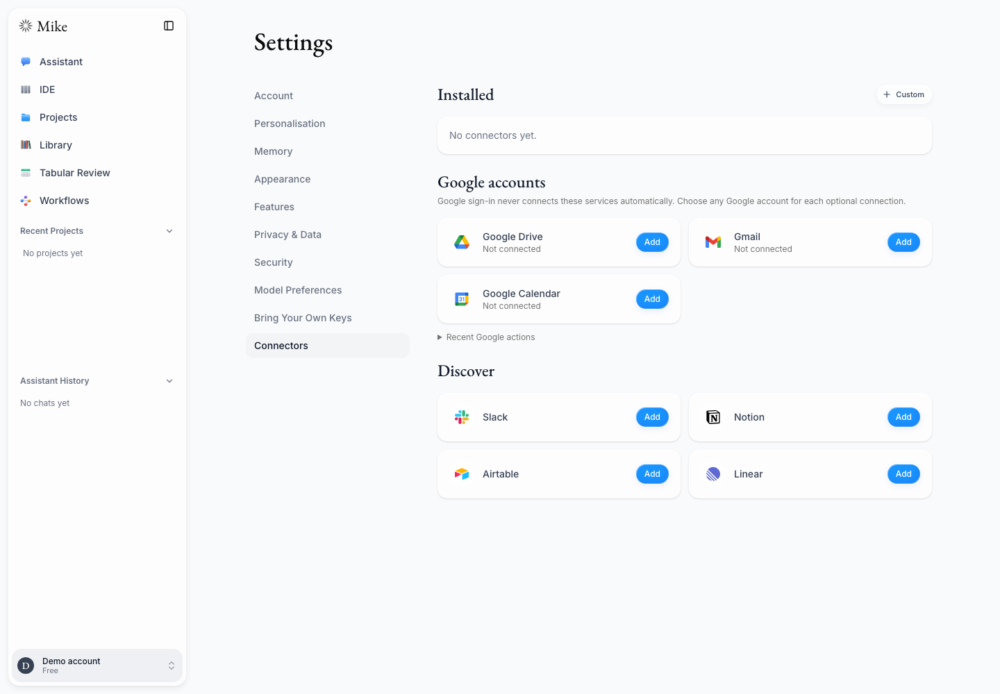

## 2. Drive setup

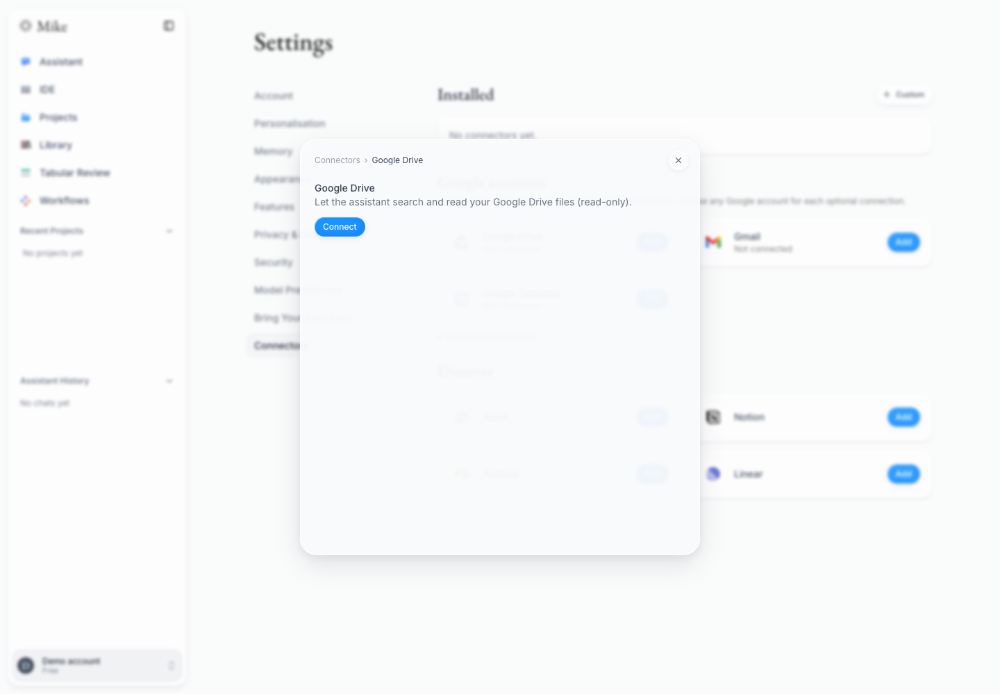

## 3. Gmail setup

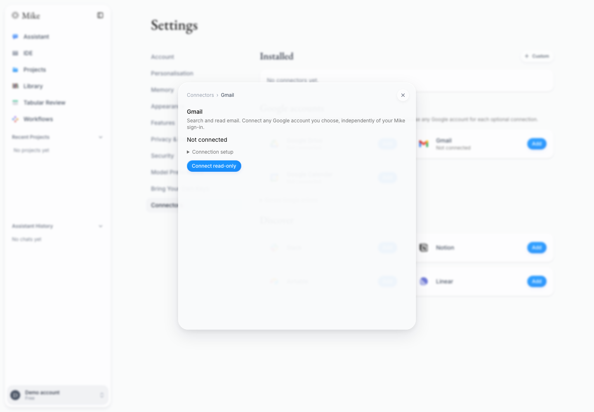

## 4. Calendar setup

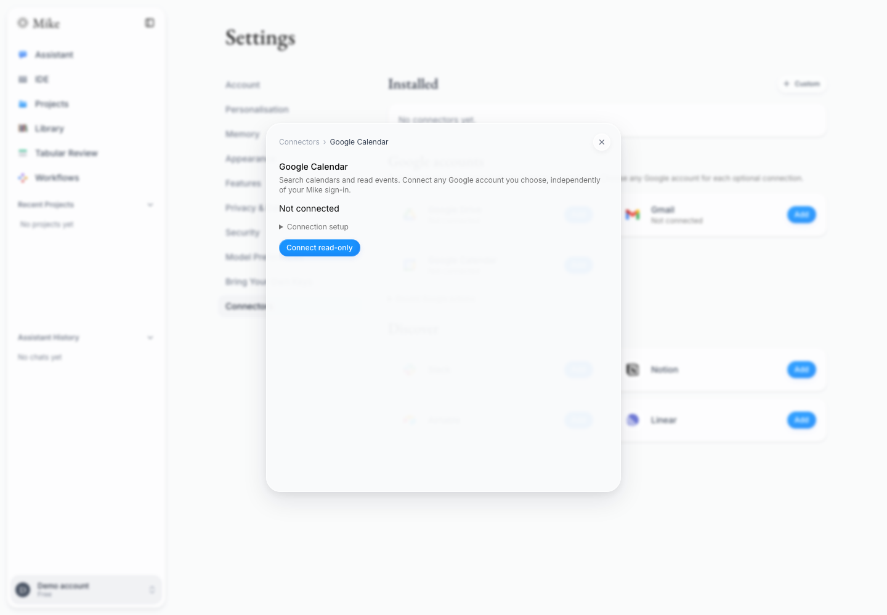

## 5. Connected services with their product logos

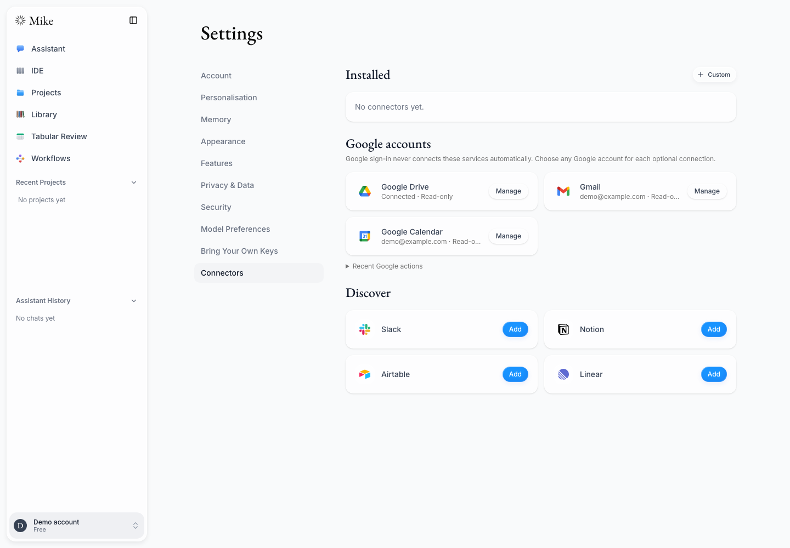

## 6. Drive connected read-only

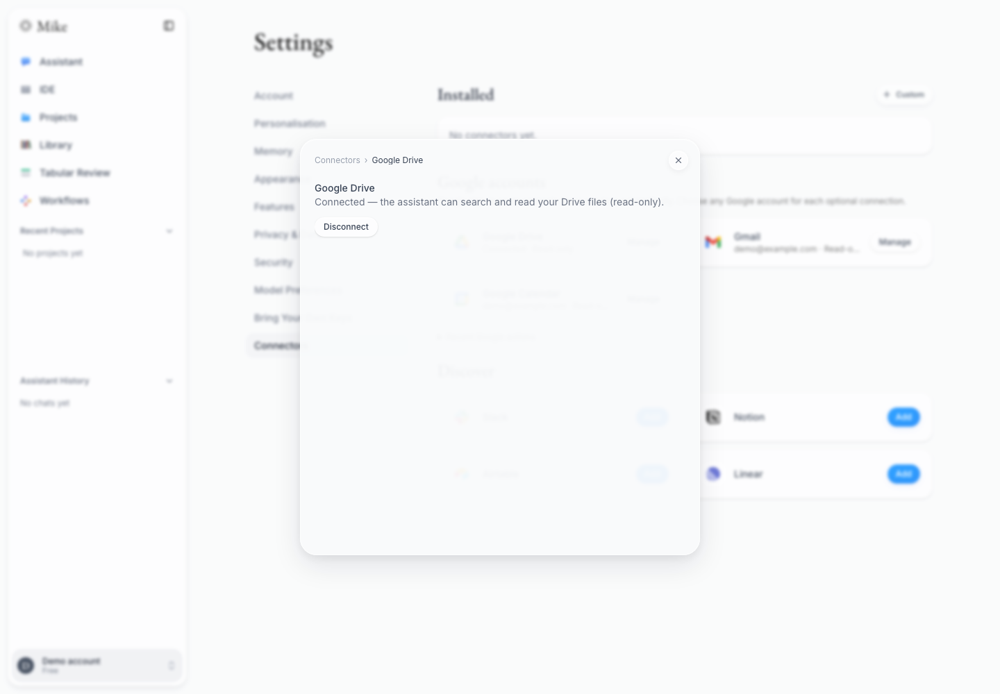

## 7. Gmail connected read-only and optional write upgrade

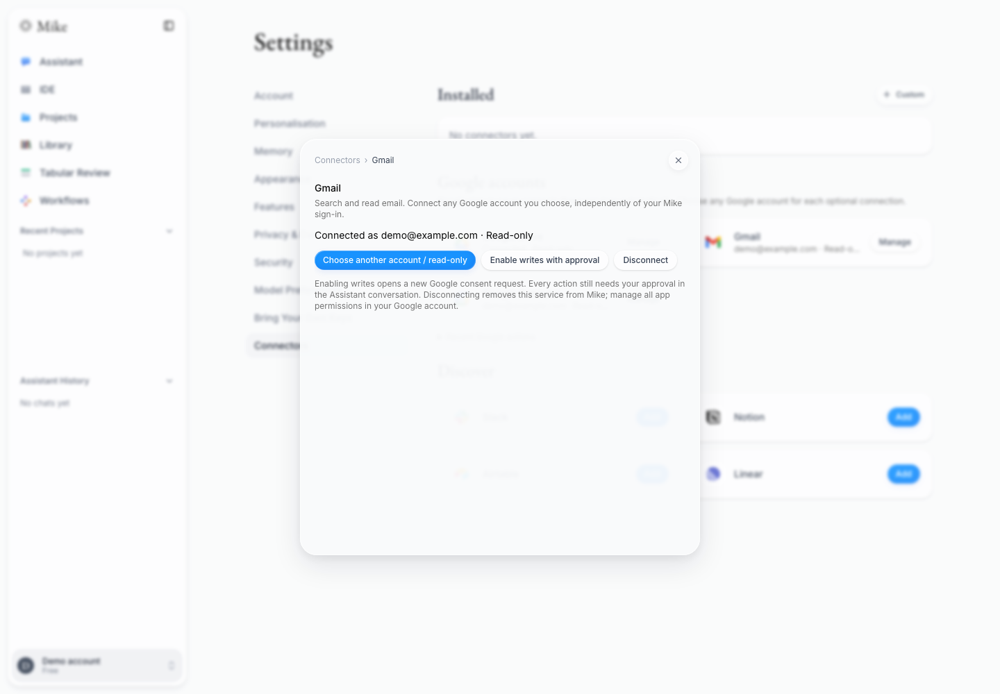

## 8. Calendar connected read-only and optional write upgrade

## 9. Gmail after optional write consent

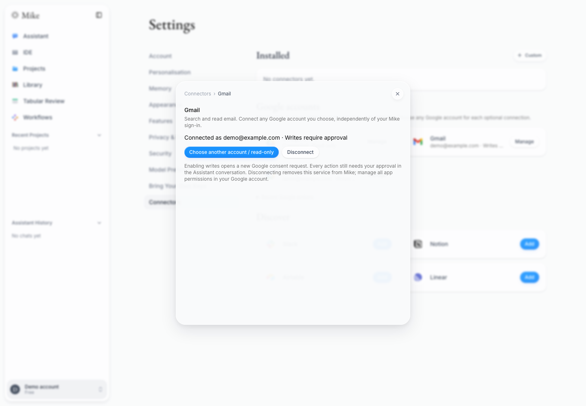

## 10. Calendar after optional write consent

## 11. Review an email action inside Assistant

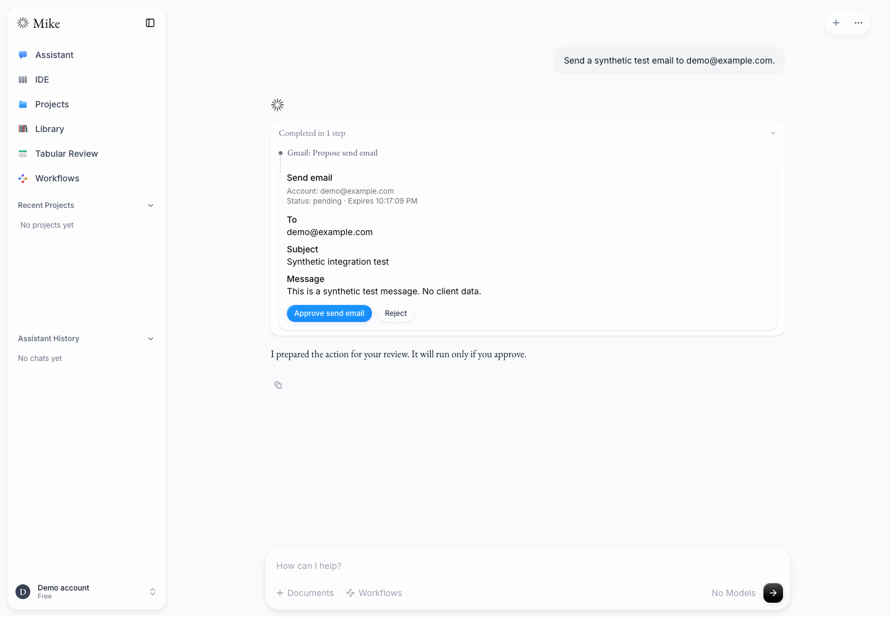

## 12. Email action completion inside Assistant

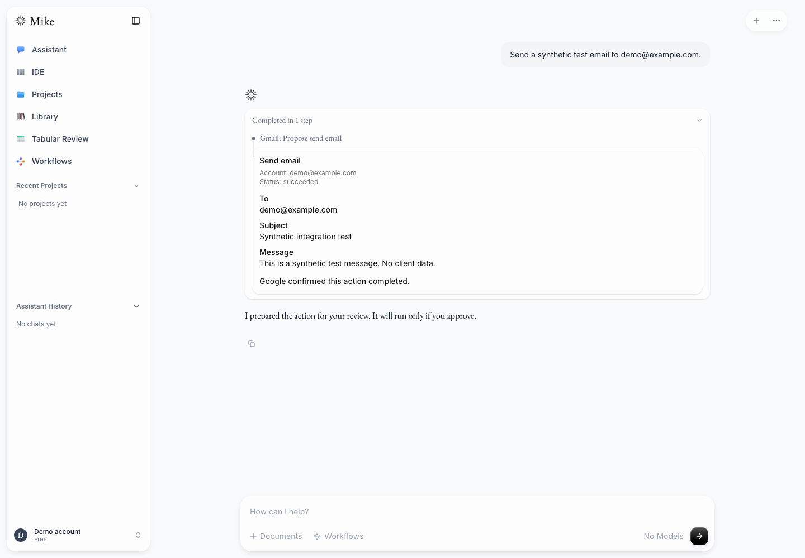

## 13. Review a calendar action inside Assistant

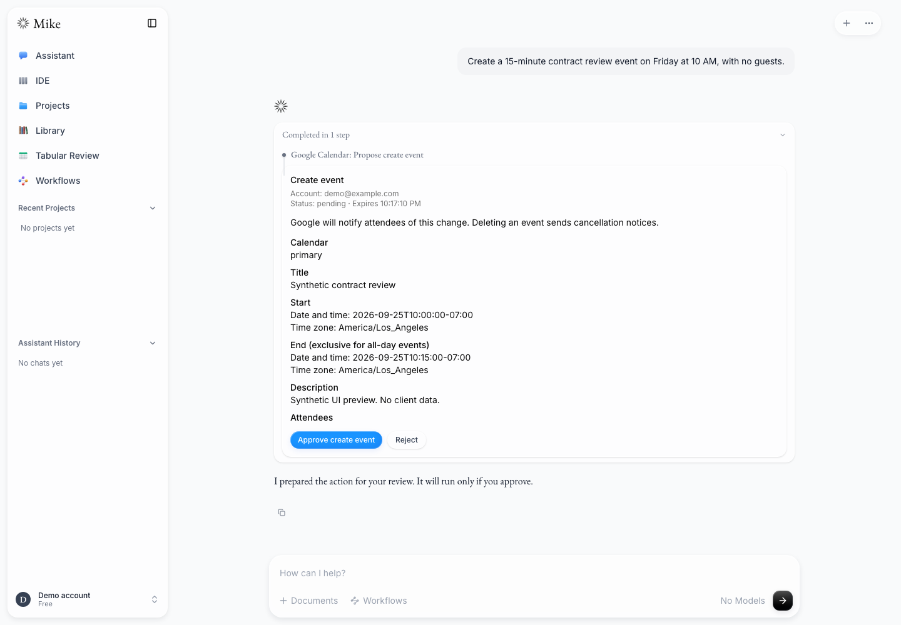

## 14. Rejected calendar action inside Assistant

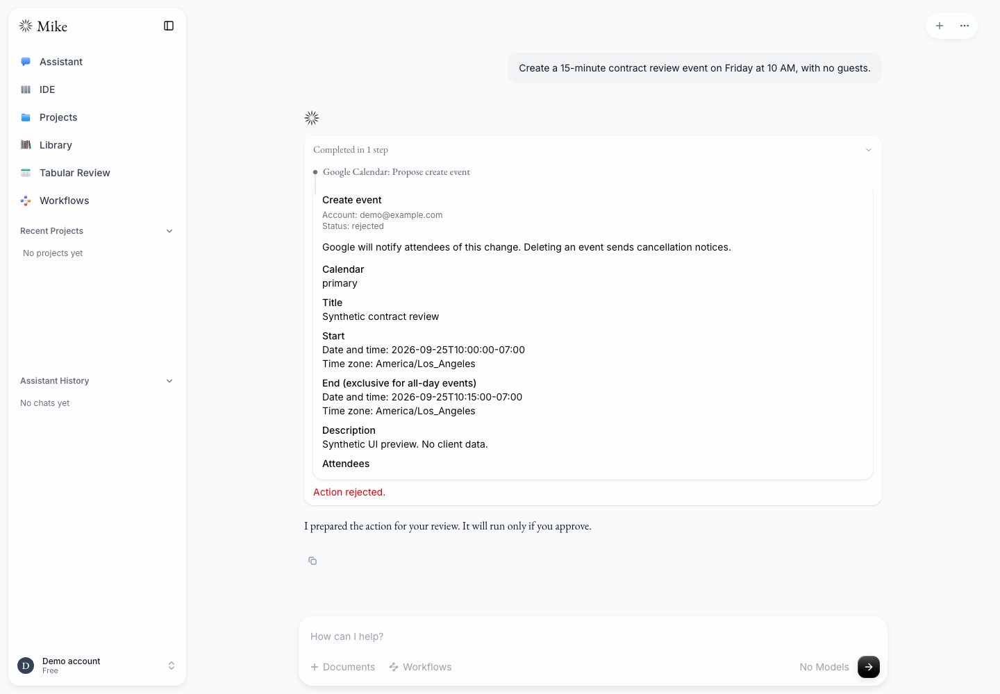

## 15. Previously captured live Drive document read

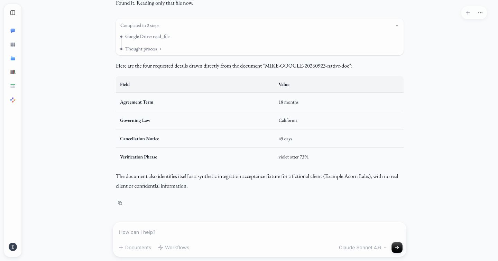

## 16. Previously captured live Calendar event read

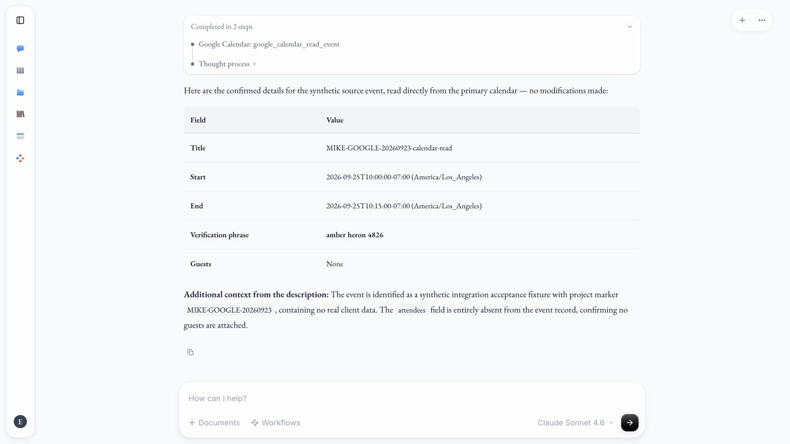

## 17. Previously captured live Gmail/Calendar read-only boundary

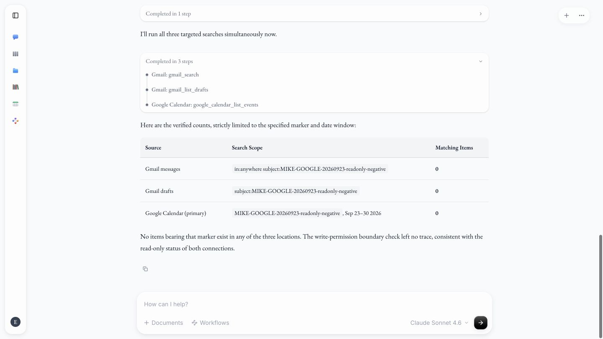

